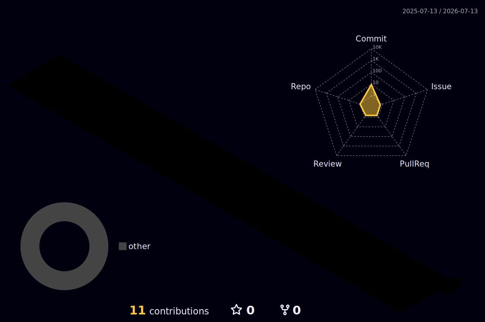

<!--
  Profile README — evertonfridrich-ops
  Commit em: github.com/evertonfridrich-ops/evertonfridrich-ops (repo especial, público)
  Paleta: Séquito — #0D1117 / #C41E3A / #E85D04 / #C9D1D9
-->

 

  

  
  
  

 

  
  
  

---

### Quem eu sou

**Everton Fridrich** — engenheiro de produto que transforma operação de restaurante (pedidos, cozinha, frota, pagamentos e fiscal) em software próprio, sem depender só de marketplaces.

> Proposta de valor: *reduzir a dependência de intermediários e devolver controle operacional (PDV + delivery + motoboys) para o restaurante, com stack multi-tenant pronta para produção.*

| Sinal | Evidência |
| ----- | --------- |
| Produto âncora | **Séquito** — SaaS delivery/PDV/logística (~70% roadmap v1.0) |
| Stack de domínio | Client Engineering · Realtime Logistics · Payments · Multi-tenant Data |
| Contribuições no monorepo | 300+ commits no ciclo do produto (time + maintainer) |
| Conta GitHub | desde out/2025 · foco em shipping, não em vanity metrics |

### Domínios (não lista de logos)

| Domínio | O que entrego |
| ------- | ------------- |
| **Client Engineering** | Next.js 16 App Router, React 19, dashboards operacionais, cardápio/PDV |
| **Mobile Field Ops** | App Expo do motoboy — OTP, GPS, copilot, chamada mascarada iFood |
| **Realtime Logistics** | Telemetria, H3, despacho, co-delivery com privacidade LGPD |
| **Payments & Fiscal** | Stripe, Asaas, webhooks assinados, DANFE |
| **Platform / Trust** | Supabase RLS multi-tenant, Sentry, circuit breakers, CI institucional |

<strong>Tech stack completa</strong> (clique para expandir)

 

| Categoria | Tecnologias |
| --------- | ----------- |
| **Frontend** | Next.js 16, React 19, TypeScript strict, Tailwind CSS 4, Recharts |
| **Mobile** | Expo 57, React Native, expo-router |
| **Backend** | Server Actions, Zod, BullMQ, Redis |
| **Data** | Supabase PostgreSQL, Auth, RLS, Realtime |
| **Search / AI** | Meilisearch, Google Gemini |
| **Payments** | Stripe, Asaas |
| **Observability** | Sentry, PostHog |
| **Quality** | Vitest, Playwright, ESLint, Prettier, Husky, commitlint |
| **Ship** | Vercel, Docker multi-stage, GitHub Actions |

  
  
  
  
  
  
  
  

### Skills (nível operacional)

  

### Projetos em destaque

| Repo | Papel | Status |
| ---- | ----- | ------ |
| [`projeto-ifood` → Séquito](https://github.com/evertonfridrich-ops/projeto-ifood) | Produto principal: delivery + PDV + app motoboy + iFood | Ativo (privado → tornar público ou open-core) |
| [`conselho-ia-saas`](https://github.com/evertonfridrich-ops/conselho-ia-saas) | SaaS de conselho consultivo com IA | Privado |
| [`visao-comps-akaai-proptech`](https://github.com/evertonfridrich-ops/visao-comps-akaai-proptech) | Protótipo Visão Comps (proptech) | Privado |

> **Próximo passo de visibilidade:** o produto Séquito ainda é privado — considere um mirror público de docs/demo ou open-core para recrutadores/VCs avaliarem o código.

### Estatísticas

  
  &nbsp;
  

  

  

  

### Engenharia visual avançada

  <strong>🐍 Contribution Snake</strong> 
  Atualizado automaticamente a cada 12h via GitHub Actions

<picture>
  <source media="(prefers-color-scheme: dark)" srcset="https://raw.githubusercontent.com/evertonfridrich-ops/evertonfridrich-ops/output/github-contribution-grid-snake-dark.svg" />
  <source media="(prefers-color-scheme: light)" srcset="https://raw.githubusercontent.com/evertonfridrich-ops/evertonfridrich-ops/output/github-contribution-grid-snake.svg" />
  
</picture>

  <strong>📊 Gráfico 3D de contribuições</strong>

  

  <a href="https://skyline.github.com/evertonfridrich-ops/2025">🏙️ GitHub Skyline 2025</a>
  ·
  <a href="https://skyline.github.com/evertonfridrich-ops/2026">🏙️ GitHub Skyline 2026</a>

  
   
  Built with institutional engineering standards · Séquito 2026

