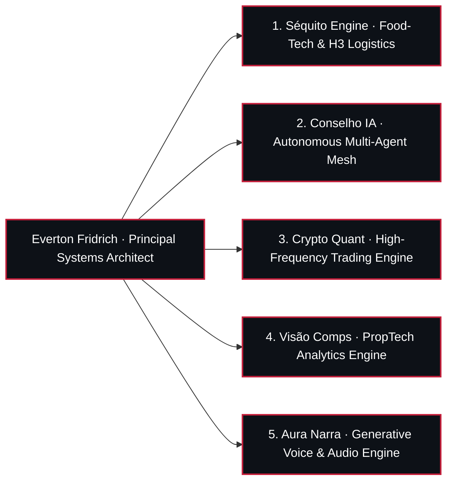
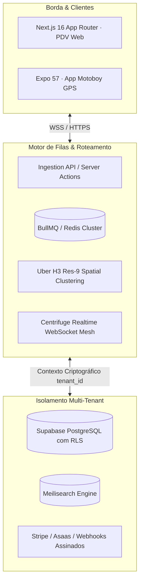
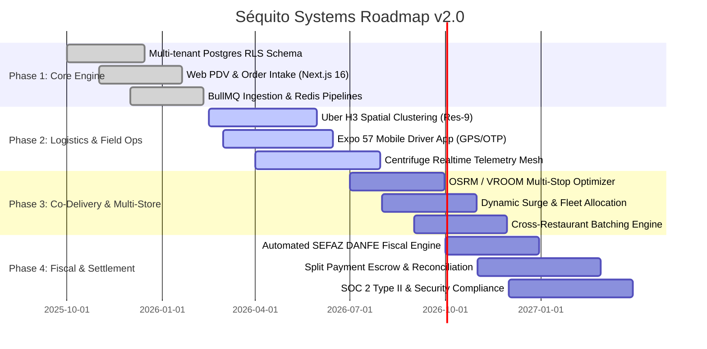
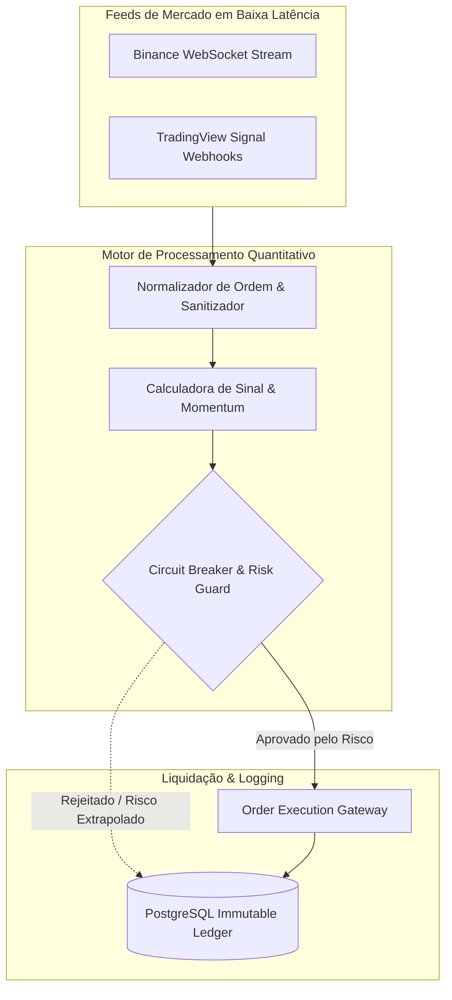
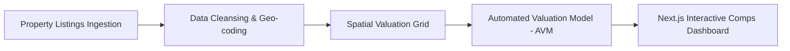
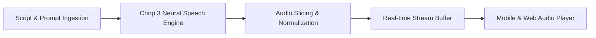

<div align="center">
  
</div>

<br/>

<div align="center">
  <a href="https://git.io/typing-svg">
    
  </a>
</div>

<p align="center">
  
  
  
  
  
</p>

---

## 🏛️ Systems Portfolio & Engineering Matrix

> **Interactive Architecture Breakdown:** Clique em qualquer ecossistema abaixo para inspecionar a topografia do sistema, topologia de rede, garantias de SLA, roadmap iterativo e padrões de isolamento.


```mermaid
graph LR
    Architect[Everton Fridrich · Principal Systems Architect]
    Architect --> S1[1. Séquito Engine · Food-Tech & H3 Logistics]
    Architect --> S2[2. Conselho IA · Autonomous Multi-Agent Mesh]
    Architect --> S3[3. Crypto Quant · High-Frequency Trading Engine]
    Architect --> S4[4. Visão Comps · PropTech Analytics Engine]
    Architect --> S5[5. Aura Narra · Generative Voice & Audio Engine]

    classDef core fill:#0D1117,stroke:#C41E3A,stroke-width:2px,color:#fff;
    class Architect,S1,S2,S3,S4,S5 core;
```

---

## 🔍 Deep Dive de Arquitetura por Ecossistema

<details open>
<summary>📦 <strong>1. Séquito Engine — Food-Tech SaaS &amp; Realtime H3 Logistics (Project v2.0 Roadmap)</strong></summary>
<br>

#### 📐 Topografia Distribuída do Sistema

```mermaid
flowchart TD
    subgraph EdgeLayer [Borda & Clientes]
        PDV[Next.js 16 App Router · PDV Web]
        Mobile[Expo 57 · App Motoboy GPS]
    end

    subgraph AsyncCore [Motor de Filas & Roteamento]
        Ingestion[Ingestion API / Server Actions]
        Queue[(BullMQ / Redis Cluster)]
        H3Engine[Uber H3 Res-9 Spatial Clustering]
        Centrifuge[Centrifuge Realtime WebSocket Mesh]
    end

    subgraph Persistence [Isolamento Multi-Tenant]
        DB[(Supabase PostgreSQL com RLS)]
        Meili[(Meilisearch Engine)]
        Gateways[Stripe / Asaas / Webhooks Assinados]
    end

    EdgeLayer <-->|WSS / HTTPS| AsyncCore
    AsyncCore <-->|Contexto Criptográfico tenant_id| Persistence
```

#### 🗺️ Séquito Product v2.0 — Milestone Execution Roadmap

```mermaid
gantt
    title Séquito Systems Roadmap v2.0
    dateFormat  YYYY-MM-DD
    section Phase 1: Core Engine
    Multi-tenant Postgres RLS Schema       :done, p1_1, 2025-10-01, 2025-12-15
    Web PDV & Order Intake (Next.js 16)    :done, p1_2, 2025-11-01, 2026-01-20
    BullMQ Ingestion & Redis Pipelines     :done, p1_3, 2025-12-01, 2026-02-10
    
    section Phase 2: Logistics & Field Ops
    Uber H3 Spatial Clustering (Res-9)     :active, p2_1, 2026-02-15, 2026-05-30
    Expo 57 Mobile Driver App (GPS/OTP)    :active, p2_2, 2026-03-01, 2026-06-15
    Centrifuge Realtime Telemetry Mesh     :active, p2_3, 2026-04-01, 2026-07-30
    
    section Phase 3: Co-Delivery & Multi-Store
    OSRM / VROOM Multi-Stop Optimizer      :p3_1, 2026-07-01, 2026-09-30
    Dynamic Surge & Fleet Allocation       :p3_2, 2026-08-01, 2026-10-31
    Cross-Restaurant Batching Engine       :p3_3, 2026-09-01, 2026-11-30
    
    section Phase 4: Fiscal & Settlement
    Automated SEFAZ DANFE Fiscal Engine    :p4_1, 2026-10-01, 2026-12-31
    Split Payment Escrow & Reconciliation  :p4_2, 2026-11-01, 2027-02-28
    SOC 2 Type II & Security Compliance    :p4_3, 2026-12-01, 2027-03-31
```

#### 🛡️ Invariantes de Engenharia & Métricas de Missão Crítica
* **Clusterização Geoespacial:** Agrupamento dinâmico de rotas em resolução hexagonal H3 (Res-9) em `< 2s`.
* **Zero-Trust Multi-Tenancy:** 100% das tabelas protegidas por Row Level Security com chave estrita de `tenant_id`.
* **Desacoplamento Assíncrono:** Falhas de rede em gateways de pagamento ou emissão de DANFE são amortecidas via BullMQ com dead-letter queues e retry exponencial.

</details>

<details>
<summary>🤖 <strong>2. Conselho IA — Autonomous Multi-Agent Intelligence Pipeline</strong> (Clique para expandir)</summary>
<br>

#### 📐 Topografia da Rede de Agentes

```mermaid
flowchart LR
    User[User Consultation Query] --> Orchestrator[Master Advisory Orchestrator]
    
    subgraph MultiAgentMesh [Conselho de Especialistas Virtuais]
        VP[VP of Engineering Agent]
        CISO[CISO Security & Compliance Agent]
        Quant[Quant Portfolio Strategist Agent]
        DevRel[DevRel & Branding Agent]
    end

    subgraph ConsensusPipeline [Camada de Julgamento & Refino]
        Debate[Peer Cross-Evaluation / Debate Engine]
        Synthesizer[Consolidated Report Generator]
    end

    Orchestrator --> MultiAgentMesh
    MultiAgentMesh --> Debate
    Debate --> Synthesizer
    Synthesizer --> Output[Relatório Institucional Acionável]
```

#### 🛡️ Invariantes de Engenharia & Métricas de Missão Crítica
* **Orquestração Paralela Quota-Aware:** Execução assíncrona com balanceamento dinâmico de taxa e limites de tokens de LLM.
* **Anti-Alucinação & Consenso Cruzado:** Validação estrita por matriz de consenso onde teses conflitantes são arbitradas antes da síntese final.
* **Saída Estruturada:** Contratos de resposta validados em tempo de execução via schemas Zod / Pydantic.

</details>

<details>
<summary>📈 <strong>3. Crypto Quant Engine — Algorithmic Trading &amp; Execution Systems</strong> (Clique para expandir)</summary>
<br>

#### 📐 Pipeline de Telemetria e Execução de Ordens

```mermaid
flowchart TD
    subgraph MarketFeeds [Feeds de Mercado em Baixa Latência]
        Binance[Binance WebSocket Stream]
        TradingView[TradingView Signal Webhooks]
    end

    subgraph CoreEngine [Motor de Processamento Quantitativo]
        Parser[Normalizador de Ordem & Sanitizador]
        RiskManager{Circuit Breaker & Risk Guard}
        Strategy[Calculadora de Sinal & Momentum]
    end

    subgraph Execution [Liquidação & Logging]
        ExchangeAPI[Order Execution Gateway]
        AuditLog[(PostgreSQL Immutable Ledger)]
    end

    MarketFeeds --> Parser
    Parser --> Strategy
    Strategy --> RiskManager
    RiskManager -->|Aprovado pelo Risco| ExchangeAPI
    RiskManager -.->|Rejeitado / Risco Extrapolado| AuditLog
    ExchangeAPI --> AuditLog
```

#### 🛡️ Invariantes de Engenharia & Métricas de Missão Crítica
* **Circuit Breakers de Capital:** Trava automática de segurança em caso de slippage excessivo ou volatilidade anômala.
* **Logs Imutáveis de Auditoria:** Rastreabilidade criptográfica de cada preenchimento de ordem e cálculo de slippage.
* **Execução Assíncrona Não-Bloqueante:** Loop de eventos isolado de I/O em disco.

</details>

<details>
<summary>🏢 <strong>4. Visão Comps — PropTech Real Estate Analytics Engine</strong> (Clique para expandir)</summary>
<br>

#### 📐 Topologia do Pipeline de Avaliação Imobiliária

```mermaid
flowchart LR
    Scraper[Property Listings Ingestion] --> Normalizer[Data Cleansing & Geo-coding]
    Normalizer --> SpatialIndex[Spatial Valuation Grid]
    SpatialIndex --> AVM[Automated Valuation Model - AVM]
    AVM --> Dashboard[Next.js Interactive Comps Dashboard]
```

#### 🛡️ Invariantes de Engenharia & Métricas de Missão Crítica
* **Indexação Geoespacial:** Comparação de imóveis semelhantes por raio de vizinhança, histórico de transações e atributos padronizados.
* **Deduplicação Inteligente:** Algoritmos de correlação para unificar anúncios duplicados entre imobiliárias.

</details>

<details>
<summary>🎙️ <strong>5. Aura Narra — Generative Audio &amp; Narrative Media Engine</strong> (Clique para expandir)</summary>
<br>

#### 📐 Pipeline de Síntese Neural de Voz

```mermaid
flowchart LR
    Script[Script & Prompt Ingestion] --> TTS[Chirp 3 Neural Speech Engine]
    TTS --> AudioBuffer[Audio Slicing & Normalization]
    AudioBuffer --> StreamEngine[Real-time Stream Buffer]
    StreamEngine --> MobileClient[Mobile & Web Audio Player]
```

#### 🛡️ Invariantes de Engenharia & Métricas de Missão Crítica
* **Latência de Síntese:** Buffer de streaming em chunks que permite início de reprodução em `< 800ms`.
* **Normalização de Áudio:** Processamento de faixa dinâmica e bitrate otimizado para reprodução em dispositivos móveis.

</details>

---

## 📊 Live Operational Telemetry

<div align="center">
  
</div>

<br/>

<div align="center">
  
  &nbsp;
  
</div>

<div align="center">
  
</div>

---

## 🔒 Trust Center & Engineering Governance

```text
[CRYPTOGRAPHIC IDENTITY & SECURITY ATTESTATION]
Primary Maintainer  : Everton Fridrich (evertonfridrich-ops)
Commit Verification : GPG / SSH Verified Signatures Enforced
Supply Chain Level  : SLSA Level 3 Compliant CI Pipeline
Data Compliance     : LGPD / GDPR Multi-Tenant Strict Isolation
Contact / Inquiries : evertonfridrich@gmail.com
```

<details>
<summary>📋 <strong>Architecture Invariants Across All Systems</strong> (Clique para expandir)</summary>
<br>

1. **Zero-Trust Multi-Tenancy:** Garantia estrita de isolamento de dados por organização/cliente em todas as bases relacionais.
2. **Schema-Driven Development:** Validação rigorosa de tipos na borda com Zod e Pydantic para eliminar erros em tempo de execução.
3. **Desacoplamento Assíncrono:** Operações pesadas e integrações com terceiros operam via filas tolerantes a falhas com backoff exponencial.
4. **Observabilidade Total:** Logs estruturados em formato JSON, métricas de latência P99 e rastreamento distribuído de ponta a ponta.

</details>

---

## 🐍 Continuous Activity & Dispatch Telemetry

<div align="center">
  <picture>
    <source media="(prefers-color-scheme: dark)" srcset="https://raw.githubusercontent.com/evertonfridrich-ops/evertonfridrich-ops/output/github-contribution-grid-snake-dark.svg" />
    <source media="(prefers-color-scheme: light)" srcset="https://raw.githubusercontent.com/evertonfridrich-ops/evertonfridrich-ops/output/github-contribution-grid-snake.svg" />
    
  </picture>
</div>

<div align="center">
  
</div>

<p align="center">
  
  <br/>
  <sub>Everton Fridrich · Distributed Systems &amp; Autonomous AI Engineering · 2026</sub>
</p>
