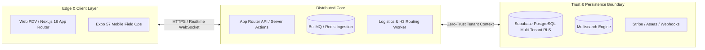

<div align="center">
  
</div>

<br/>

<div align="center">
  <a href="https://git.io/typing-svg">
    
  </a>
</div>

<p align="center">
  
  
  
  
  
</p>

---

## 🏛️ Executive Summary & Engineering Thesis

> **Engineering Mandate:** Re-architecting restaurant commerce operations from predatory marketplace dependency into institutional-grade, self-hosted multi-tenant infrastructure — encompassing high-concurrency Point of Sale (PDV), sub-second geospatial driver clustering (Uber H3), resilient async queue pipelines (BullMQ), and cryptographic data isolation.


```mermaid
flowchart LR
    subgraph ClientEdge [Edge & Client Layer]
        PDV[Web PDV / Next.js 16 App Router]
        DriverApp[Expo 57 Mobile Field Ops]
    end

    subgraph CoreEngine [Distributed Core]
        API[App Router API / Server Actions]
        Queue[(BullMQ / Redis Ingestion)]
        Worker[Logistics & H3 Routing Worker]
    end

    subgraph DataTrust [Trust & Persistence Boundary]
        DB[(Supabase PostgreSQL Multi-Tenant RLS)]
        Search[(Meilisearch Engine)]
        Gateways[Stripe / Asaas / Webhooks]
    end

    ClientEdge <-->|HTTPS / Realtime WebSocket| CoreEngine
    CoreEngine <-->|Zero-Trust Tenant Context| DataTrust
```

---

## ⚡ Systems Topography & Domain Matrix

| Subsystem Domain | Architectural Responsibility | Core Technologies & Invariants | SLA / Benchmark |
| :--- | :--- | :--- | :--- |
| **High-Throughput Client** | Sub-second order checkout, kitchen display systems (KDS), multi-store management. | `Next.js 16`, `React 19`, `Tailwind CSS 4`, `Zod v4` | P95 Load &lt; 350ms |
| **Geospatial Field Ops** | Real-time driver telemetry, OTP validation, background GPS, number masking. | `Expo 57`, `React Native`, `Centrifuge Realtime` | P99 Sync &lt; 150ms |
| **Logistics Cluster Engine** | Hexagonal dispatch mesh, OSRM/VROOM routing, co-delivery clustering. | `Uber H3 (Res-9)`, `BullMQ`, `Redis Cluster` | Dynamic batching &lt; 2s |
| **Data & Multi-Tenancy** | Zero-trust data segregation per restaurant node with row-level policies. | `Supabase Postgres`, `RLS Engine`, `SQL Migrations` | 100% Query Isolation |
| **Financial Ledger & Fiscal**| Idempotent billing, webhook signature verification, DANFE emission. | `Stripe`, `Asaas`, `Cryptographic HMAC Validation` | Zero Duplicate Charge |

---

## 📊 Live Operational Telemetry

<div align="center">
  
</div>

<br/>

<div align="center">
  
  &nbsp;
  
</div>

<div align="center">
  
</div>

---

## 🔒 Trust Center, Cryptography & Governance

```text
[CRYPTOGRAPHIC IDENTITY & SECURITY ATTESTATION]
Primary Maintainer  : Everton Fridrich (evertonfridrich-ops)
Commit Verification : GPG / SSH Verified Signatures Enforced
Supply Chain Level  : SLSA Level 3 Compliant CI Pipeline
Data Compliance     : LGPD / GDPR Multi-Tenant Strict Isolation
Security Vulnerability Disclosure: security@sequito.io / evertonfridrich@gmail.com
```

<details>
<summary>📋 <strong>Enterprise Architecture Invariants & Standards</strong> (Click to expand)</summary>
<br>

1. **Zero-Trust Multi-Tenancy:** Every mutation and query must bind to the cryptographic tenant context. Bypass attempts trigger immediate audit alerts.
2. **Deterministic Schemas:** Zero untyped boundaries. Every input into Server Actions, workers, and webhooks requires strict Zod schema validation.
3. **Resilient Asynchrony:** Network calls to external gateways (delivery platforms, payment processors) are decoupled via BullMQ workers with exponential backoff and dead-letter queues.
4. **Observable by Default:** Distributed traces and structured JSON logging hooked directly into Sentry and PostHog.

</details>

---

## 🐍 Continuous Integration & Dispatch Telemetry

<div align="center">
  <picture>
    <source media="(prefers-color-scheme: dark)" srcset="https://raw.githubusercontent.com/evertonfridrich-ops/evertonfridrich-ops/output/github-contribution-grid-snake-dark.svg" />
    <source media="(prefers-color-scheme: light)" srcset="https://raw.githubusercontent.com/evertonfridrich-ops/evertonfridrich-ops/output/github-contribution-grid-snake.svg" />
    
  </picture>
</div>

<div align="center">
  
</div>

<p align="center">
  
  <br/>
  <sub>Séquito Distributed Engine · Engineered with Staff/Tier-0 Standards · 2026</sub>
</p>
