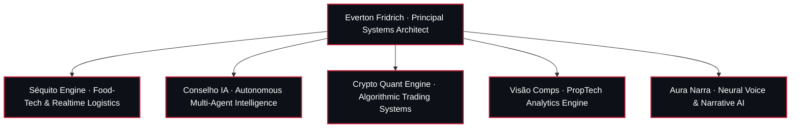

<div align="center">
  
</div>

<br/>

<div align="center">
  <a href="https://git.io/typing-svg">
    
  </a>
</div>

<p align="center">
  
  
  
  
  
</p>

---

## 🏛️ Systems Portfolio & Engineering Matrix

> **Core Focus:** Building high-reliability distributed systems across vertical SaaS, realtime geospatial logistics, autonomous multi-agent intelligence, and algorithmic trading engines.


```mermaid
graph TD
    Architect[Everton Fridrich · Principal Systems Architect]
    
    Architect --> S1[Séquito Engine · Food-Tech & Realtime Logistics]
    Architect --> S2[Conselho IA · Autonomous Multi-Agent Intelligence]
    Architect --> S3[Crypto Quant Engine · Algorithmic Trading Systems]
    Architect --> S4[Visão Comps · PropTech Analytics Engine]
    Architect --> S5[Aura Narra · Neural Voice & Narrative AI]

    classDef core fill:#0D1117,stroke:#C41E3A,stroke-width:2px,color:#fff;
    class Architect,S1,S2,S3,S4,S5 core;
```

---

## ⚡ Active Ventures & Architectural Topography

| System / Project | Domain & Responsibility | Core Stack & Invariants | Delivery Status |
| :--- | :--- | :--- | :--- |
| **Séquito** | Multi-tenant Food-Tech SaaS, PDV de alta vazão, despacho geoespacial Uber H3 e app mobile de motoboys. | `Next.js 16`, `React 19`, `Supabase RLS`, `BullMQ`, `Redis`, `Expo 57` | Production Ready (v1.0) |
| **Conselho IA** | SaaS consultivo baseado em pipeline de inteligência de nível institucional com orquestração de agentes autônomos. | `FastAPI`, `Multi-Agent Networks`, `Vector Embeddings`, `LLM Tool Mesh` | Core Architecture |
| **Crypto Quant Engine** | Robô de negociação algorítmica em criptoativos, execução de ordens e telemetria de mercado. | `Node.js`, `Python`, `Exchange WebSockets`, `Risk Management Circuit Breakers` | Active Telemetry |
| **Visão Comps** | Plataforma PropTech para precificação preditiva e inteligência de mercado imobiliário. | `Next.js App Router`, `PostgreSQL`, `Data Ingestion Pipelines` | Specialized Engine |
| **Aura Narra** | Narrative engine com síntese neural de voz em tempo real (Chirp 3) e processamento gerador de mídia. | `Generative Audio APIs`, `Chirp 3 Engine`, `TypeScript` | Prototype Active |

---

## 📊 Live Operational Telemetry

<div align="center">
  
</div>

<br/>

<div align="center">
  
  &nbsp;
  
</div>

<div align="center">
  
</div>

---

## 🔒 Trust Center & Engineering Governance

```text
[CRYPTOGRAPHIC IDENTITY & SECURITY ATTESTATION]
Primary Maintainer  : Everton Fridrich (evertonfridrich-ops)
Commit Verification : GPG / SSH Verified Signatures Enforced
Supply Chain Level  : SLSA Level 3 Compliant CI Pipeline
Data Compliance     : LGPD / GDPR Multi-Tenant Strict Isolation
Contact / Inquiries : evertonfridrich@gmail.com
```

<details>
<summary>📋 <strong>Architecture Invariants Across All Systems</strong> (Click to expand)</summary>
<br>

1. **Zero-Trust Multi-Tenancy:** Garantia estrita de isolamento de dados por organização/cliente em todas as bases relacionais.
2. **Schema-Driven Development:** Validação rigorosa de tipos na borda com Zod e Pydantic para eliminar erros em tempo de execução.
3. **Desacoplamento Assíncrono:** Operações pesadas e integrações com terceiros operam via filas tolerantes a falhas com backoff exponencial.
4. **Observabilidade Total:** Logs estruturados em formato JSON, métricas de latência P99 e rastreamento distribuído de ponta a ponta.

</details>

---

## 🐍 Continuous Activity & Dispatch Telemetry

<div align="center">
  <picture>
    <source media="(prefers-color-scheme: dark)" srcset="https://raw.githubusercontent.com/evertonfridrich-ops/evertonfridrich-ops/output/github-contribution-grid-snake-dark.svg" />
    <source media="(prefers-color-scheme: light)" srcset="https://raw.githubusercontent.com/evertonfridrich-ops/evertonfridrich-ops/output/github-contribution-grid-snake.svg" />
    
  </picture>
</div>

<div align="center">
  
</div>

<p align="center">
  
  <br/>
  <sub>Everton Fridrich · Distributed Systems &amp; Autonomous AI Engineering · 2026</sub>
</p>
