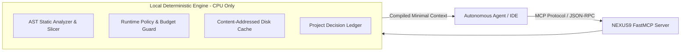
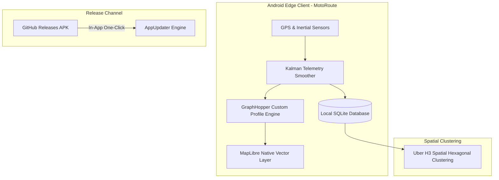
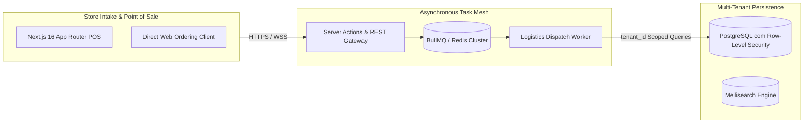
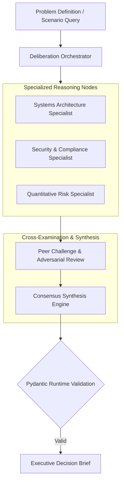

# Everton Fridrich

**Systems & Autonomous AI Engineering · Distributed Systems & Offline-First Mobile**  
Porto Alegre, RS, Brasil · [github.com/evertonfridrich-ops](https://github.com/evertonfridrich-ops) · `evertonfridrich@gmail.com`

---

## ⚡ Executive Overview

Software and systems engineer specialized in deterministic developer tooling, offline-first geospatial mobile architectures, and event-driven logistics pipelines. Core engineering focus centers on local runtime determinism, cryptographic multi-tenant isolation, and resilient distributed systems designed to run reliably under real-world resource constraints.

```text
Focus Areas     : Local-First Agent Runtimes · Geospatial Routing · Multi-Tenant Platforms
Core Languages  : Python · TypeScript / JavaScript · SQL · Shell
Primary Stacks  : Next.js (App Router) · React Native / Expo · MapLibre · FastAPI · Supabase / Postgres
Architecture    : Hexagonal / Clean Architecture · Actor & Worker Decoupling · Local-First SQLite
```

---

## 🏛️ Flagship Engineering Systems

### 1. [NEXUS9 for Google Antigravity](https://github.com/evertonfridrich-ops/nexus9-antigravity)
**Deterministic Local Context Efficiency Engine & MCP Server**  
*Status: Public Open Source (v0.3.0) · License: AGPL-3.0 · Ecosystem: Google Antigravity / Python / MCP*


```mermaid
flowchart LR
    Agent["Autonomous Agent / IDE"] -->|MCP Protocol / JSON-RPC| Server["NEXUS9 FastMCP Server"]
    
    subgraph EngineCore ["Local Deterministic Engine - CPU Only"]
        AST["AST Static Analyzer & Slicer"]
        Policy["Runtime Policy & Budget Guard"]
        Cache["Content-Addressed Disk Cache"]
        Memory["Project Decision Ledger"]
    end
    
    Server --> EngineCore
    EngineCore -->|Compiled Minimal Context| Agent
```

* **Core Problem:** Autonomous coding agents frequently saturate prompt windows with indiscriminate file reading, redundant context retransmission, and uncontrolled token consumption.
* **Technical Solution:** Built a 9-module, 24-operation deterministic engine running locally on CPU (zero background neural overhead, zero GPU/CUDA dependencies). Employs AST-based code slicing, symbol dependency extraction, response token budgets, and content-addressed SHA-256 caching.
* **Architecture & Standards:** Integrates as a native Google Antigravity Skill and Model Context Protocol (MCP 1.30.0) server. Formatted with Ruff, verified with Pytest, and packaged with Docker and self-contained installer scripts.

---

### 2. [MotoRoute GPS](https://github.com/evertonfridrich-ops/GPS-APP-MOTOBOY)
**Offline-First Turn-by-Turn Navigation & Courier Telemetry**  
*Status: Active Application (v3.1.0) · Ecosystem: React Native · Expo SDK 52 · MapLibre Native · Android*


```mermaid
flowchart TD
    subgraph EdgeDevice ["Android Edge Client - MotoRoute"]
        Sensor["GPS & Inertial Sensors"] --> Filter["Kalman Telemetry Smoother"]
        Filter --> Routing["GraphHopper Custom Profile Engine"]
        Routing --> Renderer["MapLibre Native Vector Layer"]
        Filter --> Persistence[("Local SQLite Database")]
    end

    subgraph Intelligence ["Spatial Clustering"]
        Persistence --> H3["Uber H3 Spatial Hexagonal Clustering"]
    end

    subgraph Distribution ["Release Channel"]
        GitHubReleases["GitHub Releases APK"] -->|In-App One-Click| Updater["AppUpdater Engine"]
    end
```

* **Core Problem:** Commercial turn-by-turn navigators consume high continuous bandwidth, optimize primarily for passenger cars, and degrade severely in poor signal environments or dense urban corridors.
* **Technical Solution:** Engineered an offline-first GPS application leveraging MapLibre Native vector maps, custom motorcycle routing profiles with GraphHopper, and local persistent waypoint logging via SQLite.
* **Operational Capabilities:** Integrated Uber H3 spatial resolution clustering for multi-stop delivery grouping, real-time telemetry smoothing, and automated in-app APK upgrades directly distributed via GitHub Releases.

---

### 3. [Séquito Engine](https://github.com/evertonfridrich-ops/projeto-ifood)
**High-Throughput Multi-Tenant Food-Tech & Real-Time Logistics Platform**  
*Status: Active Core Development · Ecosystem: Next.js 16 · React 19 · Supabase · BullMQ · Redis*


```mermaid
flowchart LR
    subgraph Intake ["Store Intake & Point of Sale"]
        POS["Next.js 16 App Router POS"]
        ClientApp["Direct Web Ordering Client"]
    end

    subgraph Messaging ["Asynchronous Task Mesh"]
        IngestAPI["Server Actions & REST Gateway"]
        Queue[("BullMQ / Redis Cluster")]
        Worker["Logistics Dispatch Worker"]
    end

    subgraph DataIsolation ["Multi-Tenant Persistence"]
        DB[("PostgreSQL com Row-Level Security")]
        Search[("Meilisearch Engine")]
    end

    Intake -->|HTTPS / WSS| IngestAPI
    IngestAPI --> Queue
    Queue --> Worker
    Worker -->|tenant_id Scoped Queries| DB
```

* **Core Problem:** Independent restaurants face steep marketplace commission barriers, fragile web order synchronization during traffic spikes, and data leakage risks across multi-tenant operations.
* **Technical Solution:** Architected a modular ordering and dispatch platform decoupled from marketplace lock-in. Implements strict Row-Level Security (RLS) policies enforcing multi-tenant isolation across 100% of relational tables.
* **Resilience Patterns:** Incoming order bursts and payment webhooks are buffered into BullMQ and Redis queues with exponential backoff and dead-letter handling, preventing transactional loss during downstream gateway delays.

---

### 4. [Conselho IA](https://github.com/evertonfridrich-ops/conselho-ia-saas)
**Autonomous Multi-Agent Deliberation & Cross-Examination Pipeline**  
*Status: Research & Systems Development · Ecosystem: Python · FastAPI · Pydantic · LLM Orchestration*


```mermaid
flowchart TD
    Input["Problem Definition / Scenario Query"] --> Orchestrator["Deliberation Orchestrator"]
    
    subgraph ExpertMesh ["Specialized Reasoning Nodes"]
        ArchitectNode["Systems Architecture Specialist"]
        SecurityNode["Security & Compliance Specialist"]
        QuantNode["Quantitative Risk Specialist"]
    end
    
    subgraph ConsensusMesh ["Cross-Examination & Synthesis"]
        Debate["Peer Challenge & Adversarial Review"]
        Synthesizer["Consensus Synthesis Engine"]
    end
    
    Orchestrator --> ExpertMesh
    ExpertMesh --> Debate
    Debate --> Synthesizer
    Synthesizer --> SchemaCheck{"Pydantic Runtime Validation"}
    SchemaCheck -->|Valid| Report["Executive Decision Brief"]
```

* **Core Problem:** Single-agent LLM systems exhibit ungrounded bias, blind spots, and hallucination propagation when addressing complex multi-disciplinary scenarios.
* **Technical Solution:** Designed a multi-agent consensus pipeline where independent specialist personas cross-examine competing hypotheses before aggregating conclusions. Runtime contracts are validated against strict Pydantic schemas.

---

## 🛠️ Engineering Domain Taxonomy

| Domain | Technologies & Frameworks | Architectural Patterns |
|---|---|---|
| **Systems & Developer Tooling** | Python 3.12+, TypeScript, Bash, Docker, MCP Protocol | Static AST Analysis, Content-Addressed Caching, Minimal Token Runtimes, CLI Tools |
| **Mobile & Geospatial** | React Native, Expo (SDK 52), MapLibre Native, Turf.js, SQLite | Offline-First Navigation, Hexagonal Spatial Indexing (Uber H3), Direct APK Distribution |
| **Web & Distributed Platforms** | Next.js 16 (App Router), React 19, FastAPI, Node.js | Event-Driven Workers (BullMQ/Redis), Asynchronous I/O, WebSocket Streams |
| **Data & Security Governance** | PostgreSQL, Supabase, Meilisearch, Alembic, Zod, Pydantic | Row-Level Security (RLS) Multi-Tenancy, Zero-Trust Data Isolation, Schema Enforcement |

---

## 📐 Architectural Invariants & Engineering Principles

1. **Zero-Trust Relational Multi-Tenancy:** In multi-tenant databases, multi-tenancy is enforced at the database engine level via PostgreSQL Row Level Security (RLS) linked to cryptographically signed tokens—never delegated solely to application logic.
2. **Local-First & Resource-Conscious Runtime:** Developer tools and edge applications must run predictably on standard developer hardware (including dual-core CPUs and integrated graphics), without mandatory cloud GPU dependencies.
3. **Queue-Backed Asynchronous Boundaries:** External dependencies (gateways, third-party APIs, spatial batching) communicate through durable queues with exponential backoff, circuit breaking, and dead-letter queues.
4. **Strict Schema & Type Safety:** Public boundaries, API payloads, and internal IPC events validate contracts at runtime via Zod or Pydantic, alongside strict compile-time TypeScript / MyPy checking.
5. **Absolute Evidence in Documentation:** Architectural claims reflect actual codebase implementations. Speculative certifications, synthetic uptime metrics, and inflated titles are rejected in favor of verifiable engineering artifacts.

---

## 🔒 Security, Trust & Supply Chain

* **Vulnerability Disclosure:** Security issues should be reported directly to `evertonfridrich@gmail.com` for coordinated resolution.
* **Supply Chain Discipline:** Production dependencies are tracked via lockfiles (`requirements.lock.txt`, `package-lock.json`), with explicit version boundaries.
* **Automation Least-Privilege:** GitHub Actions workflows default to read-only permissions (`permissions: contents: read`), elevating write scopes strictly where artifact publishing is required.
* **Open Source Commitment:** Open-source projects adhere to explicit licenses (e.g. AGPL-3.0 for NEXUS9) and clear contribution guidelines.

---

<p align="center">
  <sub>Everton Fridrich · Distributed Systems, Developer Tooling &amp; Autonomous AI Engineering · 2026</sub>
</p>
